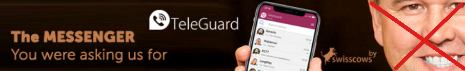

# Swisscows Banner Remover
Do you like using [Swisscows](https://swisscows.com) but you are afraid, annoyed or distracted by the smiley guy  in the banner? 

Then fear no more my friend! This extension will help you to remove this unorthodox use of display render once and for all from your screen.

## Installation
It currently only works when activating development mode in your extensions menu and load the whole folder.

- [Chrome/Brave](https://dev.to/ben/how-to-install-chrome-extensions-manually-from-github-1612) read it also to learn how to download from GitHub.
- [Edge](https://www.howtogeek.com/411830/how-to-install-google-chrome-extensions-in-microsoft-edge/)
